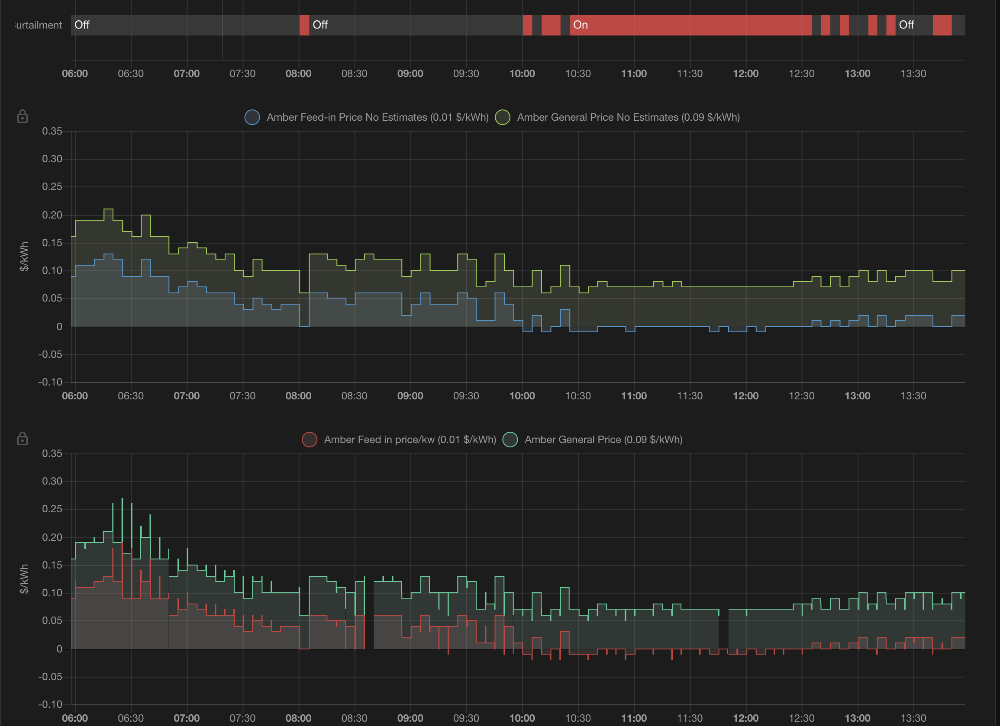

## amber_tariffs_dashboard.yaml

Displays feed-in and general prices, along with a template binary sensor to detect whether curtailment is on/off.

Requires the history-explorer-card, available through HACS.

 